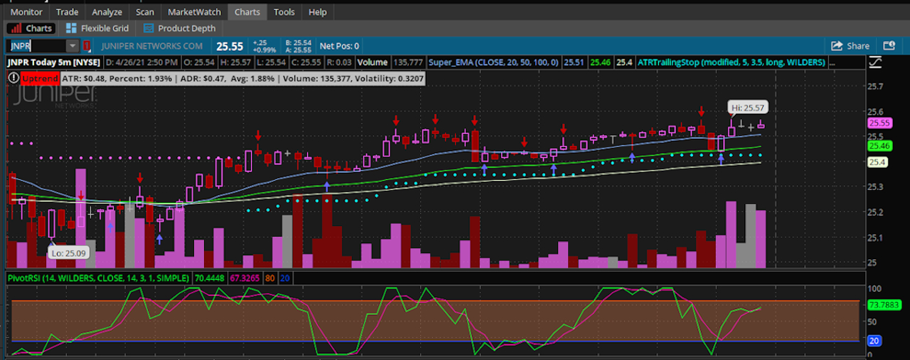
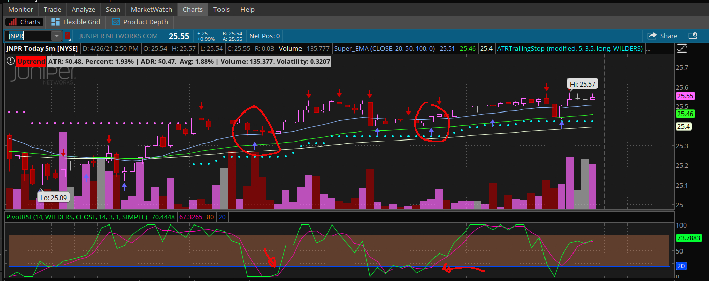
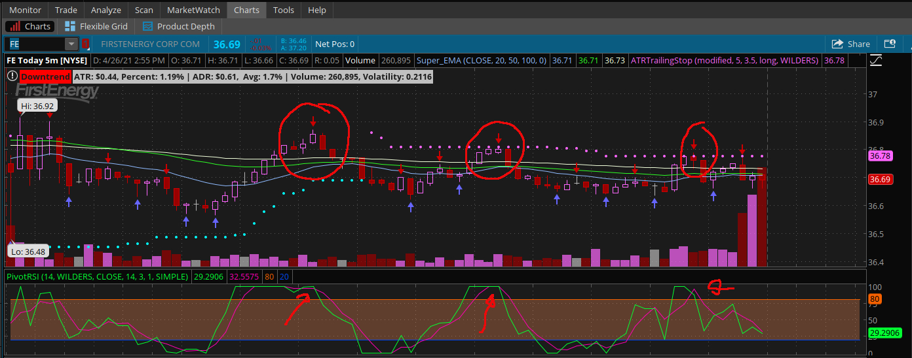

<h1 align="center">Pivot On EMA Strategy</h1>

  <a href="#dart-about">About</a> &#xa0; | &#xa0; 
  <a href="#sparkles-features">Features</a> &#xa0; | &#xa0;
  <a href="#white_check_mark-requirements">Requirements</a> &#xa0; | &#xa0;
  <a href="#runner-starting">Starting</a> &#xa0; | &#xa0;
  <a href="#chart_with_upwards_trend-usage">Usage</a> &#xa0; | &#xa0;  
  <a href="#memo-license">License</a> &#xa0; | &#xa0;
  <a href="https://github.com/TechRancher" target="_blank">Author</a>

## :dart: About ##

**Disclaimer:** _In order to demonstrate the functionality of my script, I used actual ticker symbols in the chart images. However, I do not make recommendations or determine the suitability of any security or strategy for individual traders. Any investment decision you make in your self-directed account is solely your responsibility. Be sure to backtest any strategy to determine if you understand the risks involved with each strategy._  

This strategy uses these different scripts I have written.  
[TOS_Trend_Indicator](http://tos.mx/3VcwV4A)  
[Avg_Trade_Range_Label](http://tos.mx/cZuMrVK)  
[SuperEMA](http://tos.mx/Yk58X5x)  
[PivotRSI](http://tos.mx/vyB3CWp)  
Once you have them downloaded and added to your chart studies you can start using them with this strategy.  

This strategy gives you indicators to buy long or sell short based off the 3 EMA and the Pivot RSI.  How to use this strategy will be explained below.

## :sparkles: Features ##

:heavy_check_mark: Buy long signal;\
:heavy_check_mark: Sell short signal;\
:heavy_check_mark: Trend indicator;

## :white_check_mark: Requirements ##

Before starting :checkered_flag:, you need to have [ThinkorSwim Platform](https://tdameritrade.com/tools-and-platforms.page) installed.

## :runner: Starting ##

You will need to download:  

- [TOS_Trend_Indicator](http://tos.mx/3VcwV4A/)  
- [Avg_Trade_Range_Label](http://tos.mx/cZuMrVK)  
- [SuperEMA](http://tos.mx/Yk58X5x)  
- [PivotRSI](http://tos.mx/vyB3CWp)

## :chart_with_upwards_trend: Usage ##  

Once you have all the different studies installed in ThinkorSwim and active in your chart. You can then begin using this strategy.  The image below shows all the studies that should be active on your chart.  
  
From this chart you can see three (3) colored lines under the candle sticks.  **Note: The color dots script are not included in this study _They are similar to ATP Trailing Stop script_** Then plotted below the chart is the Pivot_RSI script with the two(2) wiggly lines and a colored section in the middle.  
I will break down the three (3) lines in the chart first, then I will go into the Pivot_RSI plot.  
The three (3) lines are EMA lines. The top blue line is EMA 20 based by default on close price. The middle green line is EMA 50 based by default on close price. The bottom yellowish white line is EMA 100 which is also based by default on close price.  
The Pivot_RSI plot has two (2) lines that are Relative Strength Index which measures the speed and change of price movements. The reddish line is calculated to be smoother and will trail behind. This will give a better average strength of the index and helps with indicating the buy or sell signals. The color area between 80 and 25 signal a no buy or sell zone. If the two color RSI lines go below the 25 this is considered oversold zone and if the EMA also signals a buy then you could enter into a long trade. If the two RSI go above the 80 this is considered an overbought zone and if the EMA indicate signs for a short position then you could enter.  
The image below shows a chart that I have circle areas on it that represent buy long positions. I also added arrows to the Pivot RSI to show that it also indicates a buy position.
  
In order for this chart to give us a buy signal instead of sell signals. The EMA will need to be in this order. The EMA 100 (yellowish white line) needs to be on the bottom with the EMA 50 (green line) in the middle, and EMA 20 (blue line) will be on top. If they are not in this order then the signal can not be reliable. **Note: The blue arrows are another one of my scripts I have not included in this strategy scripts._You can use WilliamsFractal which is close to my script_** When the EMA are in this order, as soon as the candlesticks come down and touch any of the EMA and then goes up, this would be the first sign to enter. Next you need to check the Pivot RSI and see if both the RSI color lines are below the 25. As soon as the blue RSI line starts going up you would enter for long. **Make sure you set your stop loss to one EMA below where the candlestick touched.** Example of stop loss. If I was going to enter on my first circle (the circle to the left), I would set my stop loss at the green EMA 50. This stop loss can be moved up later in this trade to help cover break even. In this strategy I use the Risk to Reward of 1:1.5  

Now I will talk about entering into a short sell with this strategy.  When using this strategy to sell short, The EMA 100 (yellowish white line) will be on top, the EMA 50 (green line) will be in the middle, and EMA 20 (blue line) will be at the bottom. The candlesticks will be below the EMA.  As seen in this image below.  
  
Just like a buy signal, when the candlesticks touch any of the EMA and then pivot to the down this would be your first part of this strategy. Next you would look at the Pivot RSI to see if both RSI lines are above 80. As soon as the reddish RSI goes down (Pivot) this would be your sell short signal. Just like with the buy strategy, you would set your stop loss one EMA higher. In the first circle on the chart (the one on the far left) would have a stop loss you would have to set yourself. How I do it is, take the difference between the EMA 50 (green line) and the EMA 100 (yellowish white line) and then set my stop loss at that difference above my sell short signal. I feel it is better to take a small stop out over a large loss. In this strategy also use Risk to Reward of 1:1.5  
**Like all new strategies, make sure you backtest be become familiar with it before using your hard earn money.**
## :memo: License ##

This project is under license from GNU GENERAL PUBLIC LICENSE v.3. For more details, see the [LICENSE](LICENSE) file.

Made with :heart: by <a href="https://github.com/TechRancher" target="_blank">J Sikes</a>

&#xa0;

<a href="#top">Back to top</a>
